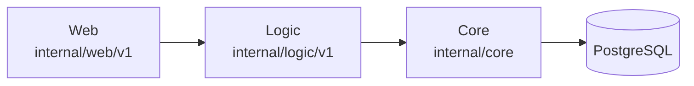

# AGENTS.md

Guidance for AI coding assistants working in `duynhlab/cart-service`. Read this
file before making changes.

## Contribution workflow for AI agents

- **Never push to `main`.** Branch from `main`, open a PR, and let CI gate the
  merge. Branches use a conventional prefix: `feat/`, `fix/`, `docs/`,
  `refactor/`, `chore/`, `test/`.
- **Squash-merge** PRs so `main` keeps one commit per change.
- **Commit subject:** ≤ 50 characters, capitalised, imperative mood, no trailing
  period (`Add cart count endpoint`, not `Added` / `Adds`).
- **Commit body** (only when the change is non-trivial): wrap at 72 characters,
  separated from the subject by a blank line, explaining *what* and *why*.
- **No attribution trailers.** Do not add `Signed-off-by`, `Co-authored-by`,
  `Assisted-by`, `Generated-by`, or any trailer attributing the work to an AI or
  tool.
- **No issue references** (`Fixes #123`) and **no @-mentions** in commit
  messages. Put issue links in the PR description instead.
- Use [Conventional Commits](https://www.conventionalcommits.org/) prefixes in
  the subject when it adds clarity (`feat:`, `fix:`, `docs:`, `refactor:`).

## Code quality

- All changes MUST pass lint before commit. CI's `go-check` job runs lint on
  every PR; PRs with lint errors are not merged.
- Match existing patterns; make surgical changes. Do not refactor unrelated
  code, reformat, or "improve" adjacent lines.
- Follow the strict 3-layer boundaries (see [Conventions](#conventions));
  violations are rejected in review.
- Check every error return (`errcheck`). Use `errors.New` over `fmt.Errorf`
  without verbs (`perfsprint`), `net.JoinHostPort` over `fmt.Sprintf`
  (`nosprintfhostport`), and `http.NewRequestWithContext` over `http.NewRequest`
  (`noctx`). Extract repeated literals to constants (`goconst`) and split
  complex functions (`gocognit`).
- Use dependency injection (constructor parameters) for all service
  dependencies. Write tests for new behaviour.

## Project overview

Shopping cart microservice for the `duynhlab` platform. Manages user carts,
items, and quantities.

- **Module:** `github.com/duynhlab/cart-service`
- **Language:** Go 1.26
- **Framework:** Gin
- **Database:** PostgreSQL via `pgx/v5` (`pgxpool`)
- **Auth:** gRPC client to auth-service via `pkg/grpcx` + `pkg/authmw`
- **Observability:** OpenTelemetry traces, OTel→Prometheus metrics, Pyroscope
  profiling, `slog` logging — all wired through `pkg/obsx`

## Repository layout

```
cart-service/
├── cmd/main.go                       # wiring: config, tracing/metrics/profiling, DB, gRPC auth client, routes
├── config/config.go                  # env-based config + Validate()
├── db/migrations/sql/                # golang-migrate 000001_*.up.sql migrations
├── internal/
│   ├── web/v1/handler.go             # CartHandler — HTTP handling, validation, error translation
│   ├── logic/v1/service.go           # CartService — business rules (NO SQL)
│   └── core/
│       ├── database.go               # pgxpool (simple-protocol for txn poolers)
│       ├── domain/                   # models, errors, CartRepository interface, transaction
│       └── repository/               # postgres_cart_repository.go (SQL)
├── middleware/                       # tracing, logging, prometheus, profiling, resource
└── Dockerfile
```

## Build, test, lint

```sh
GOTOOLCHAIN=auto go build ./...   # verify compilation
GOTOOLCHAIN=auto go vet ./...     # vet
GOTOOLCHAIN=auto go test ./...    # run tests
golangci-lint run                 # lint (golangci-lint v2, .golangci.yml)
```

Run `go mod tidy` after changing dependencies.

## Conventions

### 3-layer architecture (Web → Logic → Core, one-way)

| Layer | Location | Allowed | Forbidden |
|-------|----------|---------|-----------|
| **Web** | `internal/web/v1/` | HTTP handling, JSON binding, DTO mapping, call Logic, aggregation | SQL, direct DB access, business rules |
| **Logic** | `internal/logic/v1/` | Business rules, call repository interfaces, domain errors | SQL, `database.GetPool()`, HTTP, `*gin.Context` |
| **Core** | `internal/core/` | Domain models, repository implementations, SQL, DB connection | HTTP handling, business orchestration |

Dependency direction is strictly one-way: Web imports Logic and `core/domain`;
Logic imports `core/domain` (models + repository interfaces); Core imports
nothing from Web or Logic. Web must not call Core/repository directly, and Logic
functions are never called cross-service (use HTTP aggregation in Web).



### gRPC role: client (token validation)

cart-service is a gRPC **client**, never a server. It validates every request's
bearer token by calling `auth.v1.AuthService/GetMe` over gRPC, wired in
`cmd/main.go`:

- `grpcx.Dial(cfg.AuthGRPCAddr)` opens the connection (otel + round-robin via
  `pkg/grpcx`); target from `AUTH_GRPC_ADDR`
  (default `dns:///auth.auth.svc.cluster.local:9090`).
- `authmw.Middleware(authClient)` (from `github.com/duynhlab/pkg/authmw`) wraps
  the `/cart/v1/private` router group. It is **fail-closed**: missing token →
  401, auth `Unauthenticated` → 401, auth unreachable / other error → 503. On
  success it sets `user_id` / `username` / `email` in the Gin context, read by
  handlers via `c.GetString("user_id")`.
- Do **not** add a local JWT parser; reuse the shared `authmw` so the
  fail-closed behaviour lives in one place.

### Observability via `pkg/obsx`

Middleware chain in `cmd/main.go`, order matters: **tracing → logging →
metrics**. Each is gated by `TRACING_ENABLED` / `METRICS_ENABLED` /
`PROFILING_ENABLED`.

- **Metrics:** `obsx.SetupMetrics()` bridges OTel metrics into the Prometheus
  **default** registry, so gRPC client RED metrics (`rpc_client_*`, from the
  `pkg/grpcx` otel stats handlers) appear on the **same `/metrics` endpoint** as
  HTTP metrics. There is no separate metrics port. HTTP metrics skip infra paths
  (`/health`, `/ready`, `/metrics`).
- **Logging:** `LoggingMiddleware` attaches a `trace_id` from
  `obsx.TraceIDFromContext` (active span), falling back to `traceparent` /
  `X-Trace-ID` headers, for log↔trace correlation.
- **Tracing:** handlers open a `http.request` span via `middleware.StartSpan`.

### Routes

All cart routes are **private** — `authmw` is applied at the
`/cart/v1/private` router group.

| Method | Path | Description |
|--------|------|-------------|
| `GET` | `/cart/v1/private/cart` | Get user cart |
| `POST` | `/cart/v1/private/cart` | Add item to cart |
| `DELETE` | `/cart/v1/private/cart` | Clear cart (also called by `order-service` post-checkout with the user's forwarded `Authorization`) |
| `GET` | `/cart/v1/private/cart/count` | Cart item count (badge) |
| `PATCH` | `/cart/v1/private/cart/items/:itemId` | Update item quantity |
| `DELETE` | `/cart/v1/private/cart/items/:itemId` | Remove item |

Full convention + inventory:
[`homelab/docs/api/api-naming-convention.md`](https://github.com/duynhlab/homelab/blob/main/docs/api/api-naming-convention.md).

### Diagrams

All diagrams MUST use Mermaid syntax. Never use ASCII art.

## Gotchas and non-obvious rules

- **Kyverno image rules:** never reference `:latest`. Images must be
  `ghcr.io/duynhlab/cart-service:<sha>` or `:vX.Y.Z`. Manifests also need
  resource requests/limits and liveness/readiness probes to pass admission.
- **Migrations** run via golang-migrate v4.19.1, embedded through `embed.FS`
  (`db/migrations/embed.go`) and applied by `pkg/migratex` from the `migrate`
  subcommand. The init container reuses the app image (`args: ["migrate"]`), so
  there is no separate migration image, Dockerfile, or `.trivyignore`.
- **Database pooling:** `core/database.go` uses pgx simple-protocol because the
  shared `transaction-db` cluster sits behind a transaction-mode pooler (PgCat).
  The cluster is shared with order-service.
- **Graceful shutdown** order (VictoriaMetrics pattern): `/ready` → 503, drain
  delay, then HTTP → Database → Tracer.
